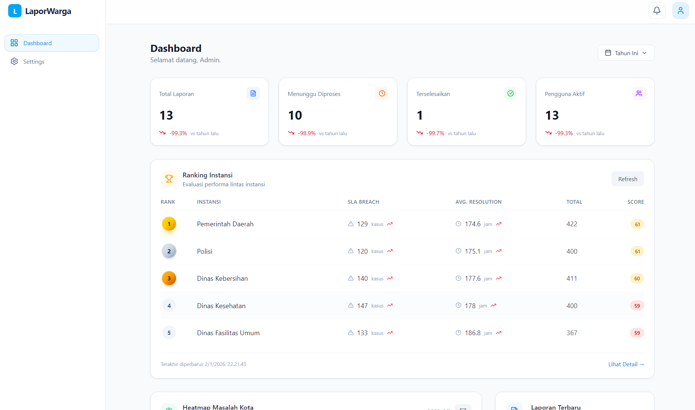

# laporwarga-dashboard

This is a dashboard service that visualizes analytics data from the analytics service.



## Running the Service

To run the service using Docker Compose:

```bash
docker compose up
```

The dashboard will be available on port 3000.

## Features

The dashboard provides the following visualizations:

- **Stats Overview**: Key metrics and statistics at a glance
- **Report Type Distribution**: Breakdown of reports by category
- **Heatmap Masalah Kota**: Geographic distribution of reported issues
- **Recent Reports**: Most recent submitted reports
- **Ranking Instansi**: Institution performance rankings
- **SLA Compliance**: Service level agreement adherence metrics
- **Mean Time to Resolution**: Average resolution time tracking
- **Eskalasi Penolakan**: Escalation and rejection analytics

## Technology Stack

- **Framework**: React with TypeScript
- **Router**: TanStack Router
- **Build Tool**: Vite
- **Styling**: CSS + Tailwind
